# Backoffice Ubademy
Trabajo Practico de Taller de Programacion 2

# Manual de Usuario

## Iniciar sesión

Al ingresar por primera vez se deben usar las credenciales Username: "admin" y Password: "admin". Ya estando logueado se pueden registrar mas administradores. Estando logueado se pueden registrar mas administradores que luego podran hacer login utilizando las credenciales provistas en el registro. 

  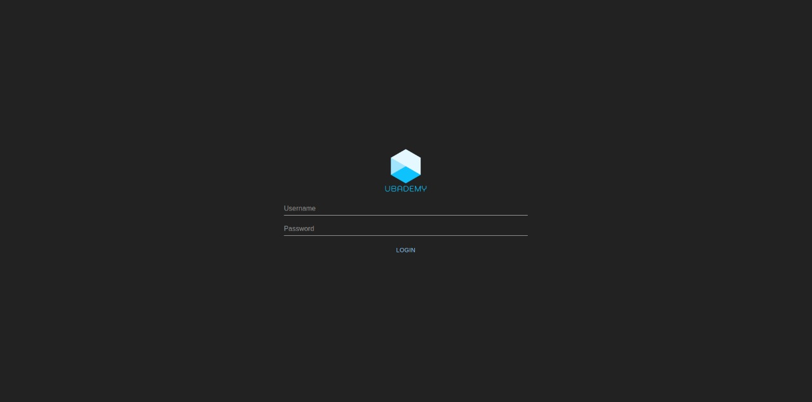

## Registro de nuevo administrador
Al ingresar las credenciales y presionar el boton "Register" se crea un nuevo administrador que podrá loguearse al backoffice.

  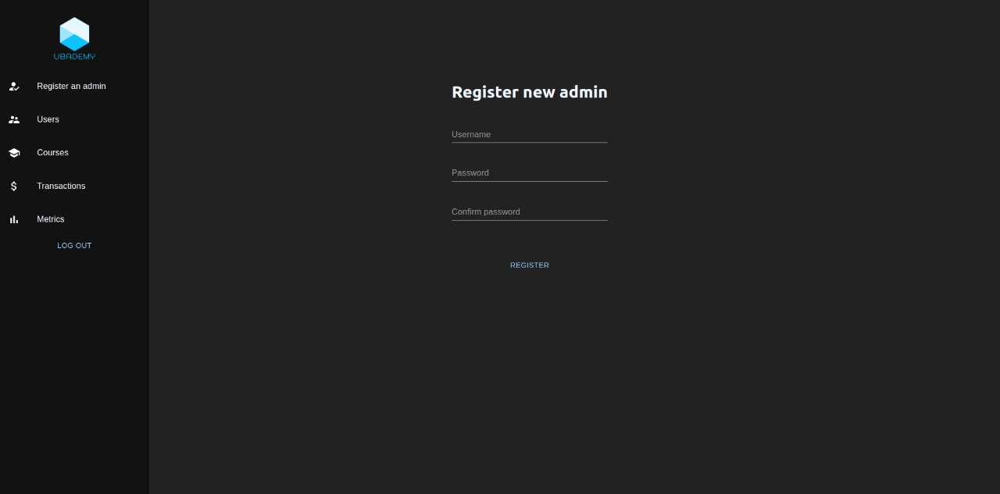

## Listado de Cursos
Aqui podemos ver un listado de los cursos del sistema. Cuando ambos filtros tienen valor None se listan todos los cursos.

  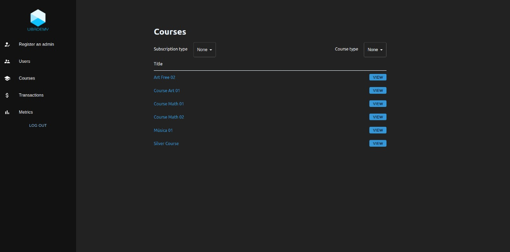

A continuación podemos ver los filtros en funcionamiento

  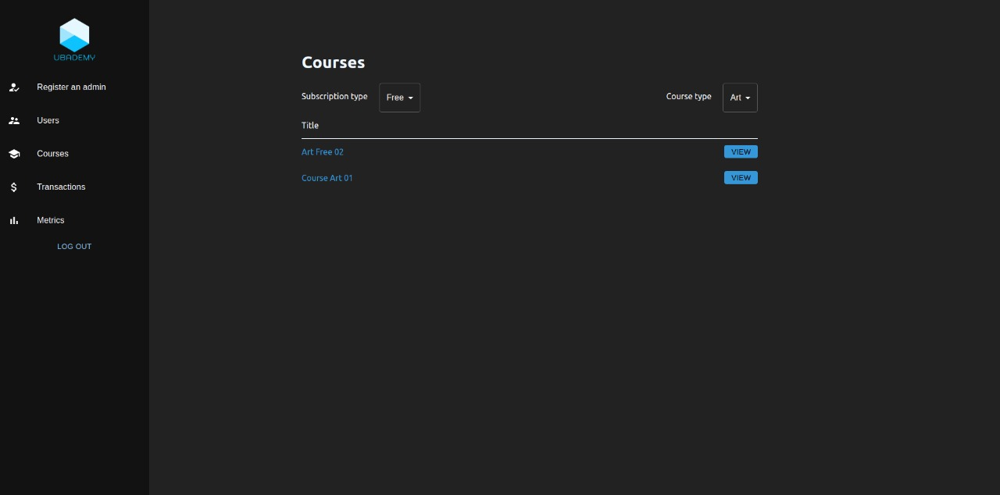

## Visualizacion de Curso
Al hacer click en el boton "View" en la lista de cursos vamos a ir a la pantalla con los detalles del curso.

  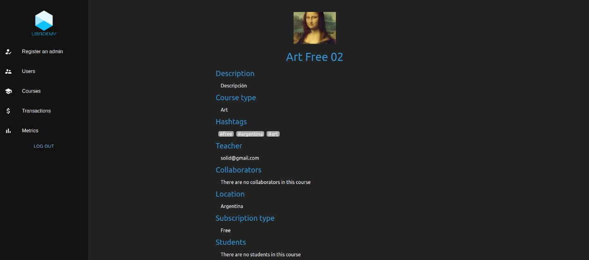

  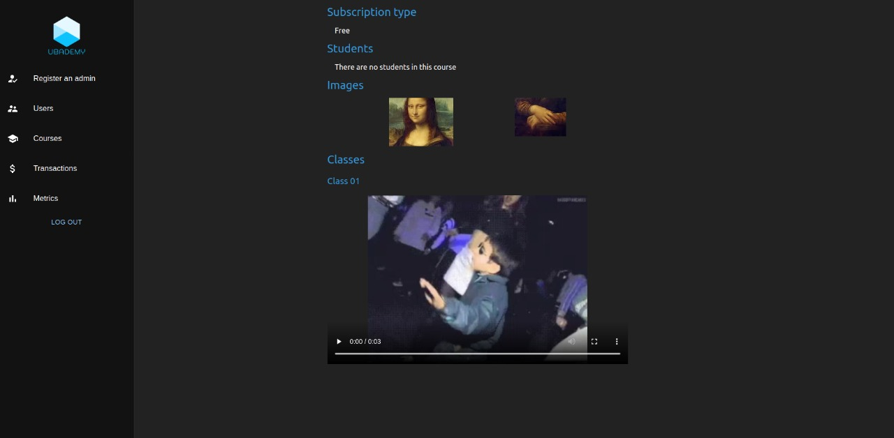

## Listado de Usuarios
Aqui podemos ver un listado de todos los usuarios del sistema, junto con su estado. Al hacer click en el boton de la columna "Status" podremos bloquear/desbloquear al usuario dependiendo su estado actual. Al hacer click en el boton "View Profile" podremos iremos a la pantalla con los detalles del usuario. Al clickear el boton "View Transactions" iremos a una pantalla que mostrará todas las transacciones en las que haya participado el usuario.

  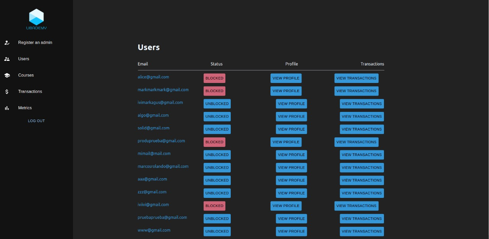

## Visualizacion de Usuario
A continuacion podemos ver la pantalla de perfil de un usuario. Esta contiene toda la informacion basica del usuario asi como tambien datos de su Wallet y los cursos en los que es estudiante, colaborador o profesor.

  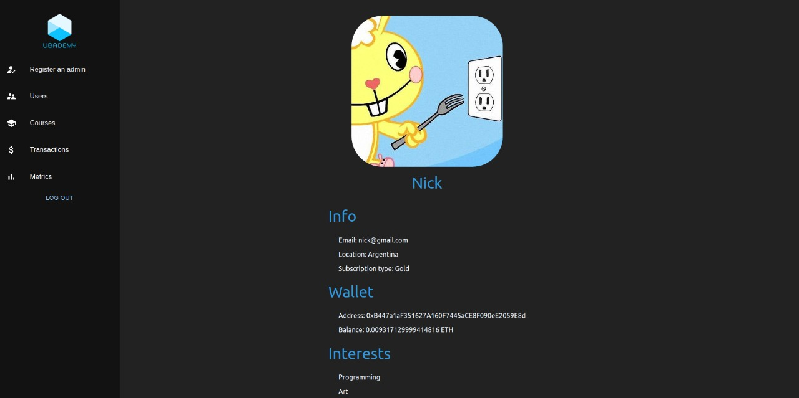

  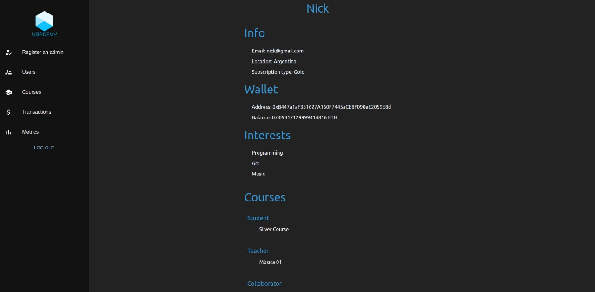

## Listado de Transacciones
Aqui podemos ver un listado de todas las transacciones del sistema. En la columna sender se encuentra quien pagó la transaccion y en receiver el que la recibió. Tambien podemos ver el valor de la transacción y tambien la fecha y horario en el que se realizó

  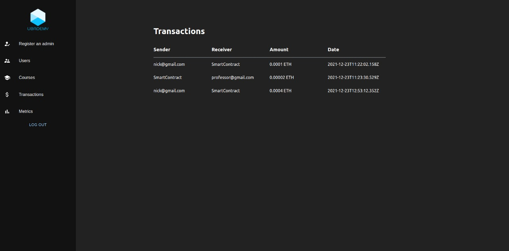

Como se habia mencionado anteriormente, podemos filtrar transacciones por usuario. Para hacer esto debemos ir a la pantalla donde se listan los usuarios y en la fila del usuario por el que quiero filtrar hacer click en el boton "View Transactions".

  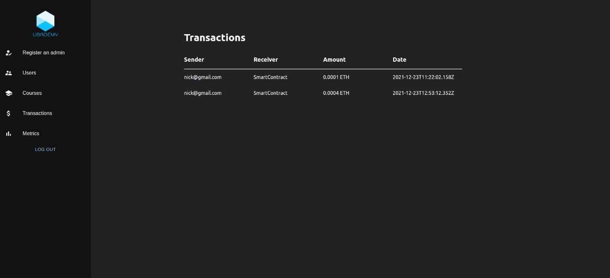

## Métricas de Usuario
La última funcionalidad del backoffice es la de listar distintas metricas relacionadas con los usuarios del sistema como se ve a continuacion.

  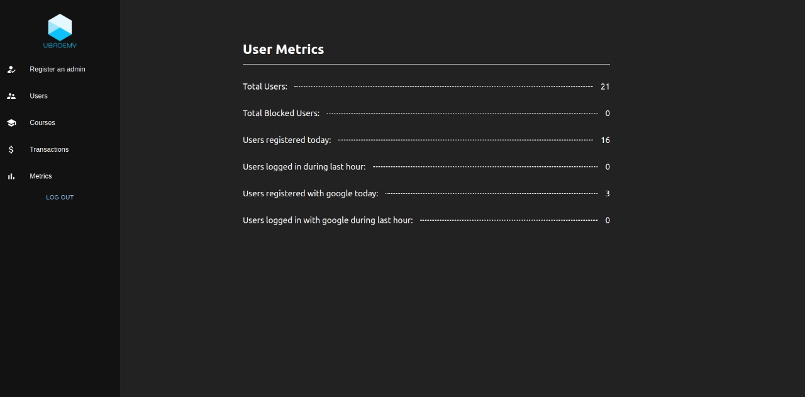

